# 개선

- 카카오톡 로그인
- 친구 창에서 친구의 realCount 보이기

# 스크린샷

1. 시작 페이지

2. 로그인 페이지

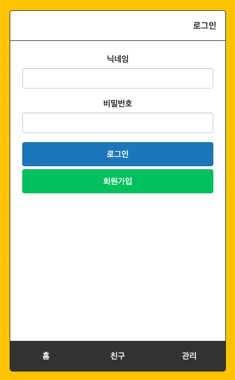

3. 회원가입 페이지

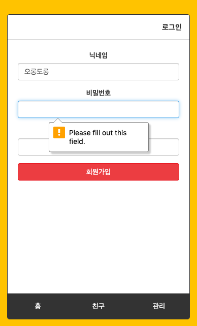

4. 회원가입 비밀번호 체크

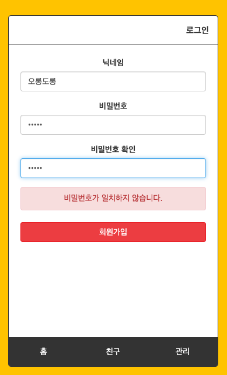

5. 로그인 후 홈

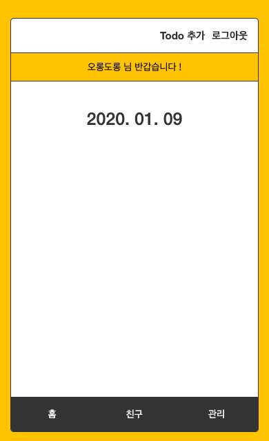

6. 친구 추가

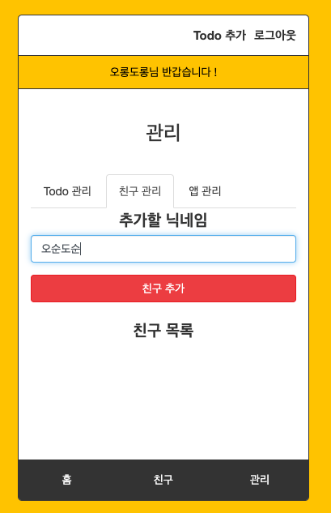

7. 친구 추가 요청

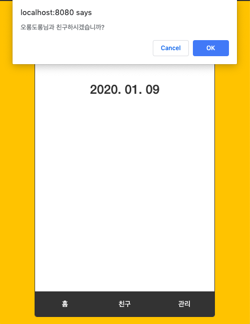

8. 친구 목록

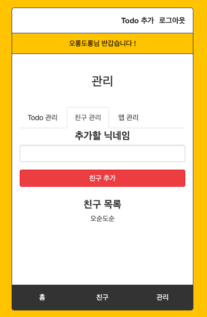

9. 함께하기 todo

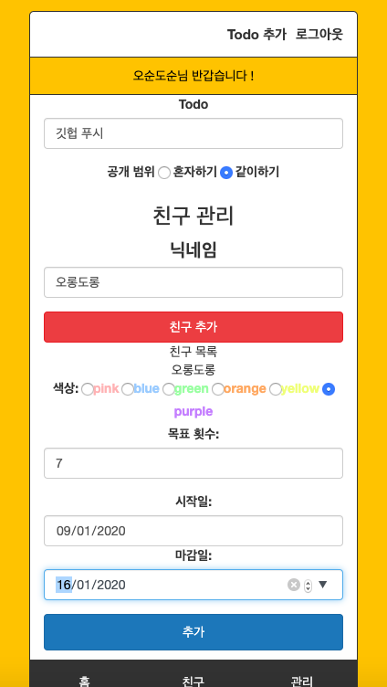

10. 함께하기 todo 요청

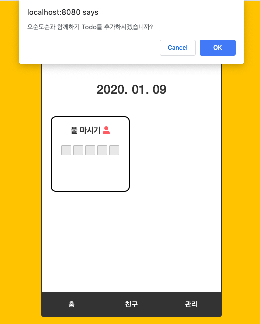

11. todo가 있는 홈

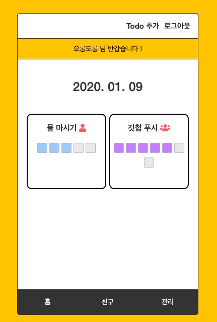

12. 관리

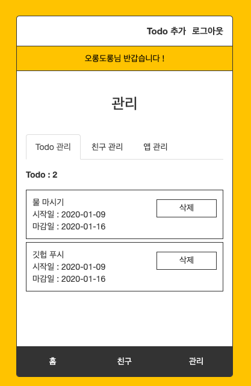

13. todo 삭제

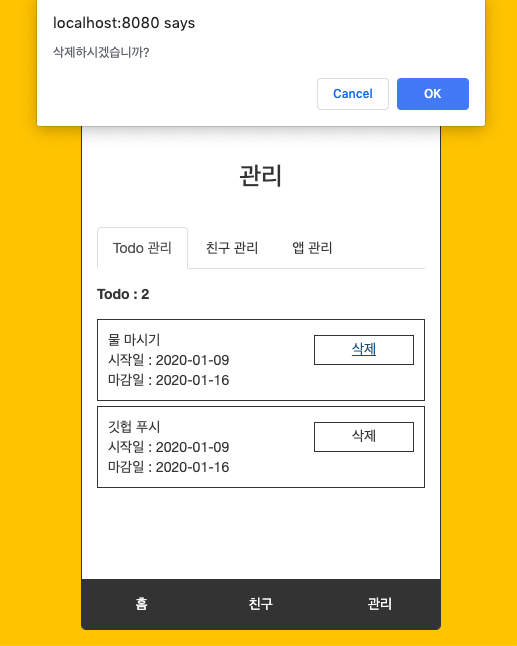

14. 로그아웃

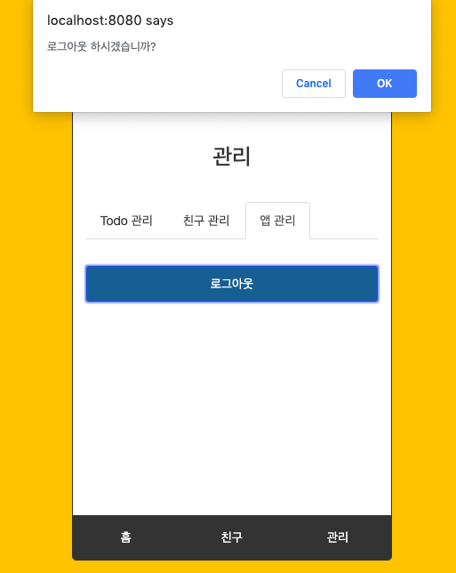

15. 캘린더

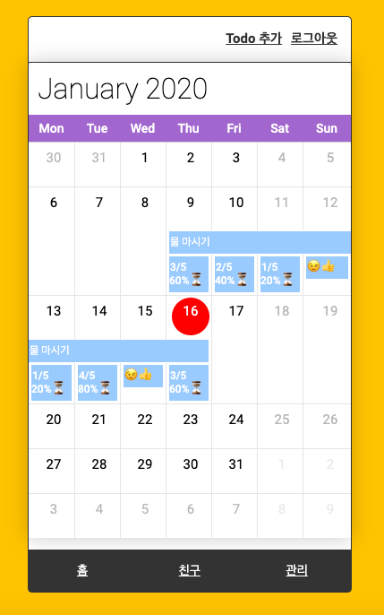

